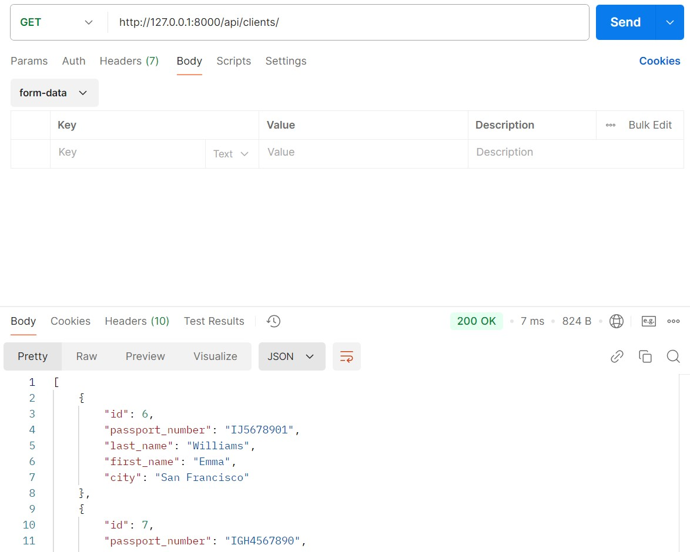
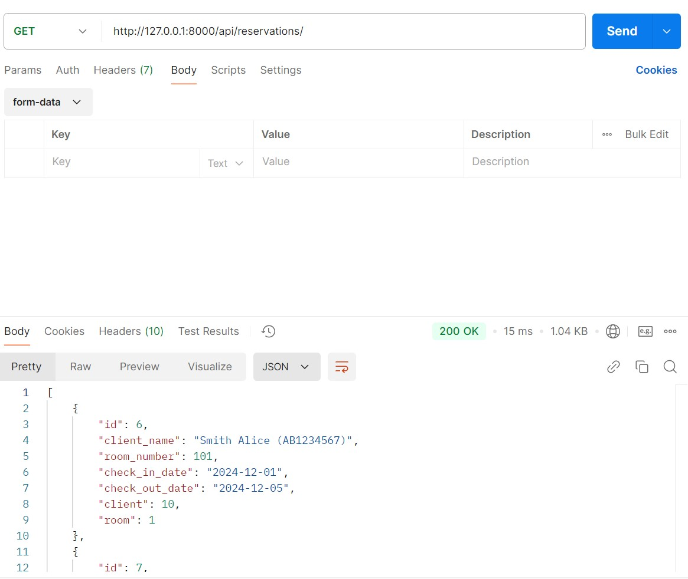
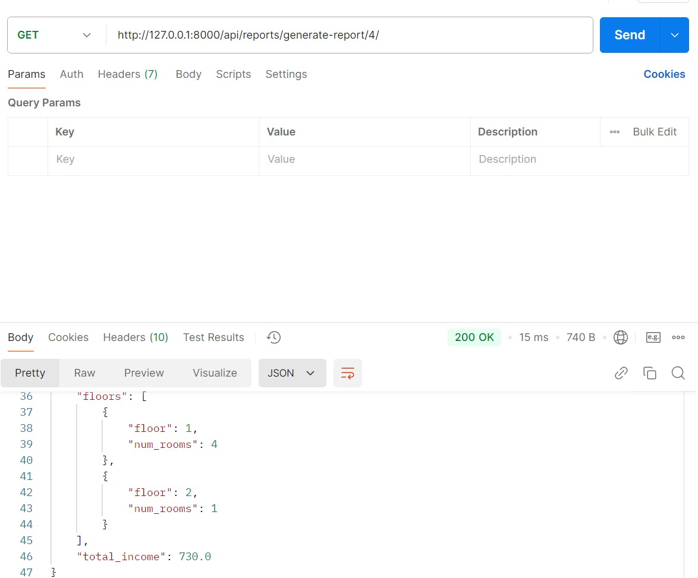

# Отчет по лабораторной работе №3

## Цель работы
Овладеть практическими навыками и умениями реализации web-сервисов
средствами Django.

## Задача лабораторной работы
Реализовать сайт, используя фреймворк Django 3, Django REST Framework, Djoser в соответствии с вариантом задания лабораторной работы.

## Зададние 1
Создать программную систему, предназначенную для администратора гостиницы.

Такая система должна обеспечивать хранение сведений об имеющихся в гостинице
номерах, о проживающих в гостинице клиентах и о служащих, убирающихся в номерах.
Количество номеров в гостинице известно, и имеются номера трех типов: одноместный,
двухместный и трехместный, отличающиеся стоимостью проживания в сутки. В каждом
номере есть телефон.

О каждом проживающем должна храниться следующая информация: номер
паспорта, фамилия, имя, отчество, город, из которого он прибыл, дата поселения в
гостинице, выделенный гостиничный номер.

О служащих гостиницы должна быть известна информация следующего содержания:
фамилия, имя, отчество, где (этаж) и когда (день недели) он убирает. Служащий
гостиницы убирает все номера на одном этаже в определенные дни недели, при этом в
разные дни он может убирать разные этажи.

Работа с системой предполагает получение следующей информации:
- о клиентах, проживавших в заданном номере, в заданный период времени;
- о количестве клиентов, прибывших из заданного города,
- о том, кто из служащих убирал номер указанного клиента в заданный день недели,
- сколько в гостинице свободных номеров;
- список клиентов с указанием места жительства, которые проживали в те же дни,
что и заданный клиент, в определенный период времени.

Администратор должен иметь возможность выполнить следующие операции:
- принять на работу или уволить служащего гостиницы;
- изменить расписание работы служащего;
- поселить или выселить клиента.

Необходимо предусмотреть также возможность автоматической выдачи отчета о
работе гостиницы за указанный квартал текущего года. Такой отчет должен содержать
следующие сведения:
- число клиентов за указанный период в каждом номере;
- количество номеров не каждом этаже;
- общая сумма дохода за каждый номер;
- суммарный доход по всей гостинице.

## Модели данных (models.py):
```python
from django.contrib.auth.models import AbstractUser
from django.db import models


class User(AbstractUser):
    is_admin = models.BooleanField(default=False)
    REQUIRED_FIELDS = ['last_name', 'first_name']


class Room(models.Model):
    SINGLE = 'Single'
    DOUBLE = 'Double'
    TRIPLE = 'Triple'
    ROOM_TYPES = [
        (SINGLE, 'Single'),
        (DOUBLE, 'Double'),
        (TRIPLE, 'Triple'),
    ]

    id = models.AutoField(primary_key=True)
    number = models.PositiveIntegerField(unique=True)
    floor = models.PositiveIntegerField()
    type = models.CharField(max_length=10, choices=ROOM_TYPES)
    price_per_day = models.DecimalField(max_digits=10, decimal_places=2)
    phone = models.CharField(max_length=15, blank=True)
    is_occupied = models.BooleanField(default=False)

    def __str__(self):
        return f"Room {self.number} ({self.type})"


class Client(models.Model):
    id = models.AutoField(primary_key=True)
    passport_number = models.CharField(max_length=15, unique=True)
    last_name = models.CharField(max_length=50)
    first_name = models.CharField(max_length=50)
    city = models.CharField(max_length=50)

    def __str__(self):
        return f"{self.last_name} {self.first_name} ({self.passport_number})"


class Staff(models.Model):
    id = models.AutoField(primary_key=True)
    last_name = models.CharField(max_length=50)
    first_name = models.CharField(max_length=50)
    profession = models.CharField(max_length=50)

    def __str__(self):
        return f"{self.last_name} {self.first_name} ({self.profession})"


class CleaningSchedule(models.Model):
    id = models.AutoField(primary_key=True)
    staff = models.ForeignKey(Staff, on_delete=models.CASCADE, related_name="schedules")
    floor = models.PositiveIntegerField()
    day_of_week = models.CharField(max_length=15)
    client = models.ForeignKey(Client, on_delete=models.CASCADE, related_name="cleaning_schedules", null=True,
                               blank=True)

    def __str__(self):
        return f"Floor {self.floor} ({self.day_of_week})"


class Reservation(models.Model):
    id = models.AutoField(primary_key=True)
    client = models.ForeignKey(Client, on_delete=models.CASCADE, related_name="reservations")
    room = models.ForeignKey(Room, on_delete=models.CASCADE, related_name="reservations")
    check_in_date = models.DateField()
    check_out_date = models.DateField()

    def __str__(self):
        return f"Reservation: {self.client} - Room {self.room.number}"


class Report(models.Model):
    id = models.AutoField(primary_key=True)
    quarter = models.PositiveIntegerField()
    year = models.PositiveIntegerField()
    room = models.ForeignKey(Room, on_delete=models.CASCADE, related_name="reports")
    total_clients = models.PositiveIntegerField()
    total_income = models.DecimalField(max_digits=10, decimal_places=2)

    def __str__(self):
        return f"Report for {self.quarter} quarter {self.year} - Room {self.room.number}"
```
1. User: Наследуется от AbstractUser и расширяет стандартную модель пользователя в Django
- is_admin: Булево поле, обозначающее, является ли пользователь администратором.
- REQUIRED_FIELDS: Указывает обязательные поля при создании пользователя (имя и фамилия).

2. Room: Модель для описания номера в отеле
- number: Уникальный номер комнаты.
- floor: Этаж, на котором находится номер.
- type: Тип номера (одноместный, двухместный, трехместный). Выбор реализован через choices.
- price_per_day: Цена за день проживания.
- phone: Номер телефона для связи, если доступен.
- is_occupied: Указывает, занят ли номер.
- Метод __str__:Возвращает удобное текстовое представление, например: Room 101 (Single).

3. Client: Представляет информацию о клиентах отеля
- passport_number: Уникальный номер паспорта клиента.
- last_name и first_name: Имя и фамилия клиента.
- city: Город проживания.
- Метод __str__:Возвращает текстовое представление

4. Staff: Модель для хранения данных о сотрудниках
- last_name и first_name: Имя и фамилия сотрудника.
- profession: Профессия сотрудника (например, администратор, уборщик).
- Метод __str__: Возвращает строку, например

5. CleaningSchedule: График уборки для сотрудников
- staff: Ссылка на сотрудника (связь через ForeignKey).
- floor: Этаж, который должен убирать сотрудник.
- day_of_week: День недели уборки (например, "Monday").
- client: Опциональная ссылка на клиента, если уборка связана с конкретным гостем.
- Метод __str__: Возвращает строку, например: Floor 2 (Monday)

6. Reservation: Модель для управления бронированием
- client: Ссылка на клиента, который сделал бронирование.
- room: Ссылка на забронированный номер.
- check_in_date и check_out_date: Даты заезда и выезда.
- Метод __str__: Возвращает текст о бронировании

7. Report: Модель для хранения отчетов о доходах
- quarter и year: Квартал и год отчета.
- room: Ссылка на номер, по которому составлен отчет.
- total_clients: Количество клиентов за отчетный период.
- total_income: Общий доход за период.

## Эндпоинты
Информация о пользователях:
 

Информация о бронировании:
 

Отчет за квартал:

