# Отчет по практической работе №3.1

## Практическое задание 1:
Напишите запрос на создание 6-7 новых автовладельцев и 5-6 автомобилей, каждому автовладельцу назначьте удостоверение и от 1 до 3 автомобилей. Задание можете выполнить либо в интерактивном режиме интерпретатора, либо в отдельном python-файле. Результатом должны стать запросы и отображение созданных объектов. 

Для начала создадим модели в файле models.py:
```python
from django.db import models

class AutoOwner(models.Model):
    last_name = models.CharField(max_length=30)
    first_name = models.CharField(max_length=30)
    birth_date = models.DateTimeField()

    def __str__(self):
        return f"{self.first_name} {self.last_name} ({self.birth_date.strftime('%Y-%m-%d')})"

class Car(models.Model):
    registration_number = models.CharField(max_length=15)
    make = models.CharField(max_length=20)
    model = models.CharField(max_length=20)
    color = models.CharField(max_length=30, null=True, blank=True)

    def __str__(self):
        return f"{self.make} {self.model} ({self.registration_number})"

class Ownership(models.Model):
    owner = models.ForeignKey(AutoOwner, on_delete=models.CASCADE, related_name='ownerships')
    car = models.ForeignKey(Car, on_delete=models.CASCADE)
    start_date = models.DateTimeField()
    end_date = models.DateTimeField(null=True, blank=True)

    def __str__(self):
        return f"{self.owner} owns {self.car} from {self.start_date.strftime('%Y-%m-%d')}"

class DriverLicense(models.Model):
    owner = models.ForeignKey(AutoOwner, on_delete=models.CASCADE)
    license_number = models.CharField(max_length=10)
    category = models.CharField(max_length=10)
    issue_date = models.DateTimeField()

    def __str__(self):
        return f"License {self.license_number} ({self.category}) for {self.owner.first_name} {self.owner.last_name}"
```

Далее добавим данные через shell:
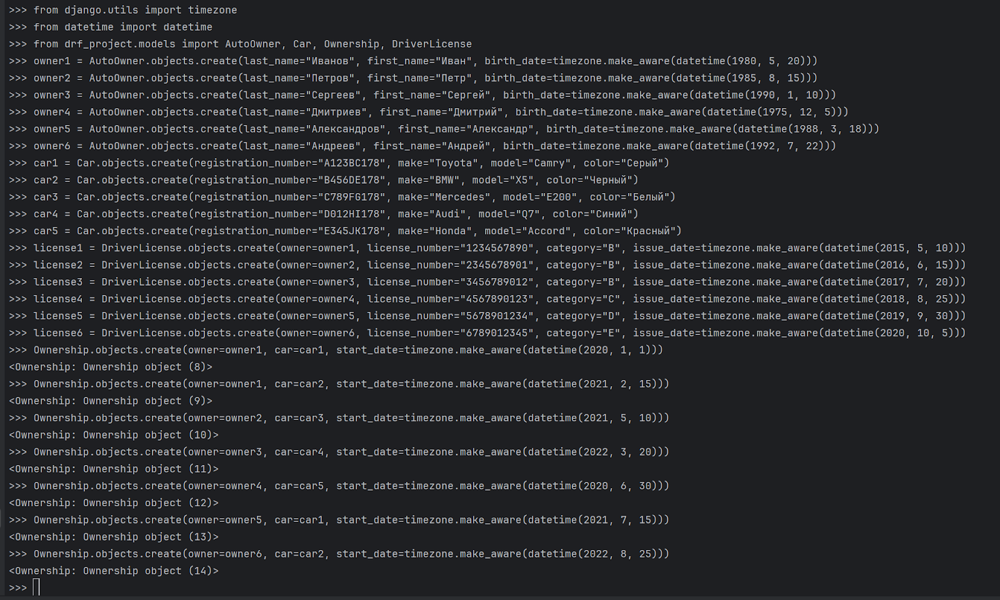

Запросы и отображения созданных объектов:

1. Автовладельцы
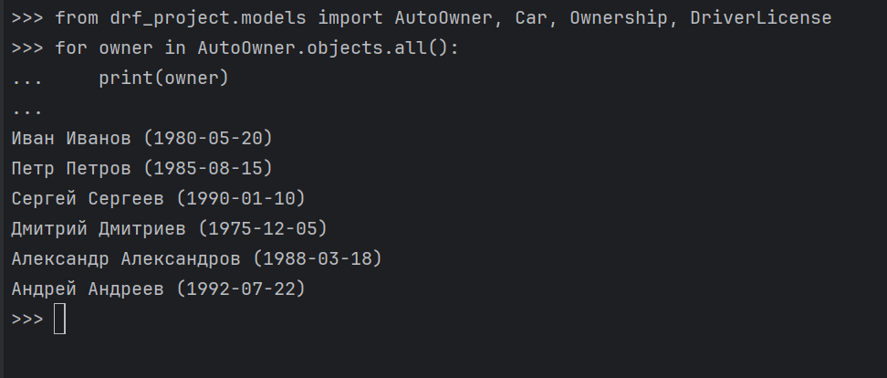

2. Автомобили
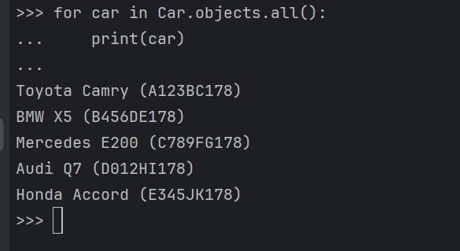

3. Водительские удостоверения:
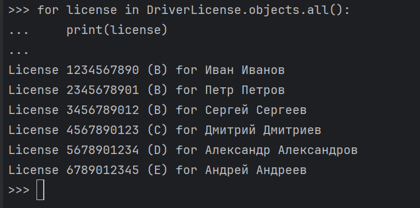

4. Владение автомобилями:
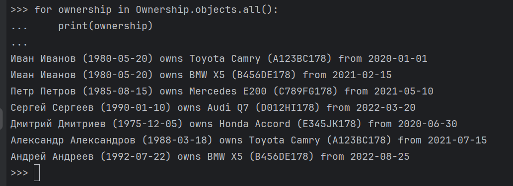

## Практическое задание 2:

Запросы на фильтрацию

1. Выведете все машины марки “Toyota”:
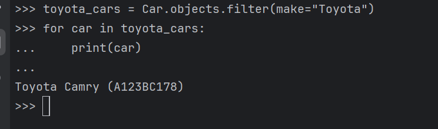
2. 
2. Найти всех водителей с именем “Андрей”:
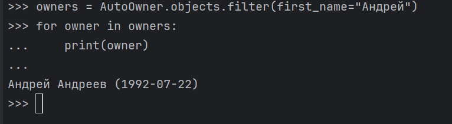

3. Взяв любого случайного владельца получить его id, и по этому id получить экземпляр удостоверения в виде объекта модели (можно в 2 запроса):
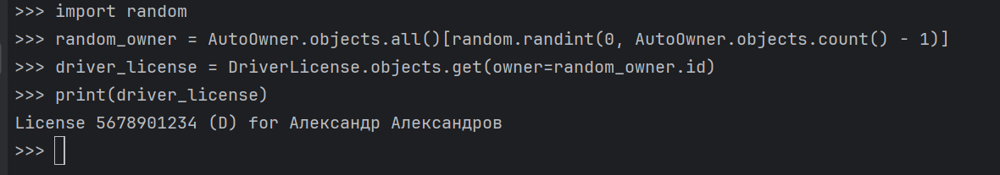

4. Вывести всех владельцев красных машин:
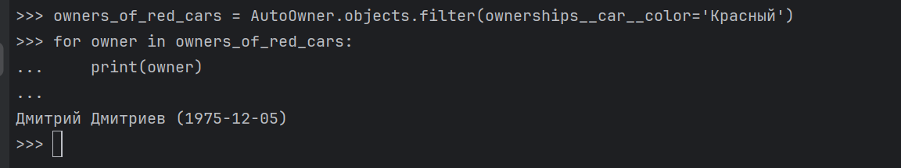

5. Найти всех владельцев, чей год владения машиной начинается с 2020:
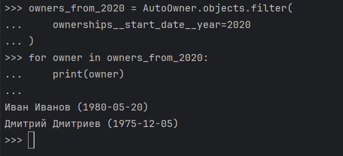

## Практическое задание 3:

1. Вывод даты выдачи самого старшего водительского удостоверения:
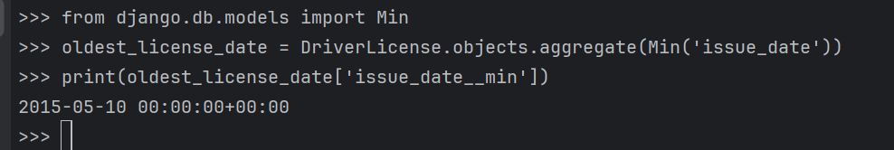

2. Укажите самую позднюю дату владения машиной, имеющую какую-то из существующих моделей в вашей базе:
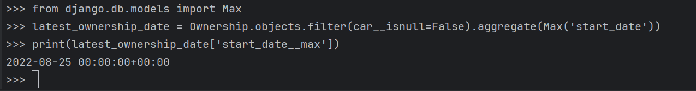

3. Выведите количество машин для каждого водителя:
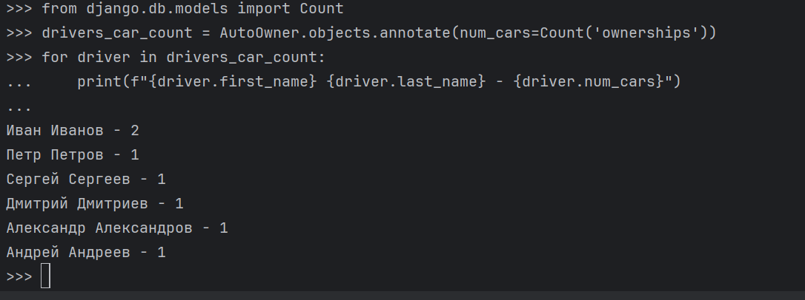

4. Подсчитайте количество машин каждой марки:
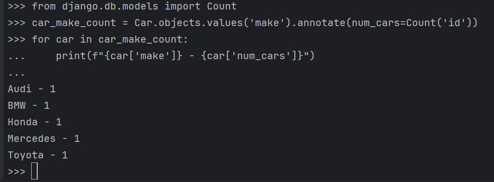

5. Отсортируйте всех автовладельцев по дате выдачи удостоверения:
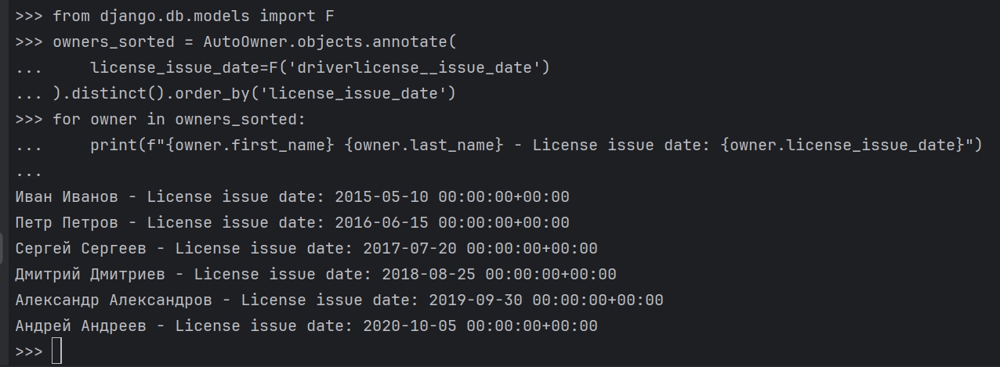